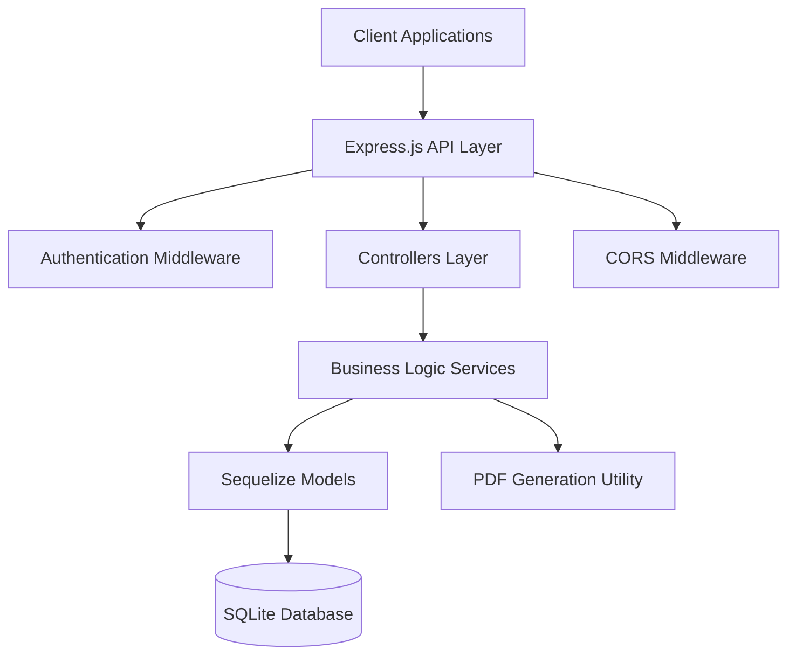

# Design Document

## Overview

The Custom Land Management System (CLMS) is a RESTful API backend built with Node.js and Express.js, using SQLite for data persistence and JWT for authentication. The system follows a layered architecture with clear separation of concerns between controllers, services, and data access layers. The design emphasizes security, scalability, and maintainability while providing comprehensive land management capabilities.

## Architecture

### System Architecture



### Technology Stack

- **Runtime**: Node.js
- **Framework**: Express.js
- **Database**: SQLite
- **ORM**: Sequelize
- **Authentication**: JWT (JSON Web Tokens)
- **Password Hashing**: bcrypt
- **PDF Generation**: PDFKit
- **Environment Management**: dotenv

### Folder Structure

```
src/
├── config/
│   └── db.js                 # Database configuration
├── models/
│   ├── User.js              # User model with roles
│   ├── LandPlot.js          # Land plot model
│   └── Transaction.js       # Transaction model
├── controllers/
│   ├── authController.js    # Authentication endpoints
│   ├── landController.js    # Land management endpoints
│   ├── transactionController.js # Transaction endpoints
│   └── reportsController.js # Reporting endpoints
├── services/
│   ├── authService.js       # Authentication business logic
│   ├── landService.js       # Land management business logic
│   ├── transactionService.js # Transaction business logic
│   └── reportsService.js    # Reports business logic
├── middlewares/
│   ├── auth.js              # JWT verification middleware
│   └── roleCheck.js         # Role-based access control
├── routes/
│   ├── auth.js              # Authentication routes
│   ├── lands.js             # Land management routes
│   ├── transactions.js      # Transaction routes
│   └── reports.js           # Reports routes
├── utils/
│   ├── pdfGenerator.js      # PDF receipt generation
│   └── validators.js        # Input validation utilities
└── server.js                # Application entry point
```

## Components and Interfaces

### Authentication System

**JWT Token Structure:**
```json
{
  "userId": "uuid",
  "email": "user@example.com",
  "role": "ADMIN|STAFF|AUDITOR",
  "iat": 1234567890,
  "exp": 1234567890
}
```

**Role Permissions Matrix:**
- **ADMIN**: Full access to all endpoints including user management
- **STAFF**: Access to land management, transactions, and receipt generation
- **AUDITOR**: Read-only access to reports and transaction data

### API Endpoints

#### Authentication Endpoints
- `POST /api/auth/register` - Create new user (ADMIN only)
- `POST /api/auth/login` - User authentication

#### Land Management Endpoints
- `POST /api/lands` - Add new land plot (ADMIN, STAFF)
- `GET /api/lands` - List all land plots (ADMIN, STAFF, AUDITOR)
- `GET /api/lands/:id` - Get specific land plot (ADMIN, STAFF, AUDITOR)
- `PUT /api/lands/:id` - Update land plot (ADMIN, STAFF)

#### Transaction Endpoints
- `POST /api/transactions` - Record new transaction (ADMIN, STAFF)
- `GET /api/transactions` - List transactions (ADMIN, STAFF, AUDITOR)
- `GET /api/transactions/:id` - Get specific transaction (ADMIN, STAFF, AUDITOR)
- `GET /api/transactions/:id/receipt` - Download PDF receipt (ADMIN, STAFF)

#### Reports Endpoints
- `GET /api/reports/summary` - Get business summary (ADMIN, AUDITOR)
- `GET /api/reports/transactions` - Get transaction reports (ADMIN, AUDITOR)

## Data Models

### User Model
```javascript
{
  id: UUID (Primary Key),
  email: STRING (Unique),
  password: STRING (Hashed),
  role: ENUM ['ADMIN', 'STAFF', 'AUDITOR'],
  firstName: STRING,
  lastName: STRING,
  createdAt: DATE,
  updatedAt: DATE
}
```

### LandPlot Model
```javascript
{
  id: UUID (Primary Key),
  plotNumber: STRING (Unique),
  location: STRING,
  size: DECIMAL,
  sizeUnit: ENUM ['ACRES', 'HECTARES', 'SQ_METERS'],
  status: ENUM ['AVAILABLE', 'SOLD', 'DISPUTED', 'RESERVED'],
  ownerName: STRING,
  description: TEXT,
  registrationDate: DATE,
  createdAt: DATE,
  updatedAt: DATE
}
```

### Transaction Model
```javascript
{
  id: UUID (Primary Key),
  landPlotId: UUID (Foreign Key),
  buyerName: STRING,
  buyerContact: STRING,
  sellerName: STRING,
  sellerContact: STRING,
  salePrice: DECIMAL,
  commissionRate: DECIMAL,
  commissionAmount: DECIMAL,
  transactionDate: DATE,
  receiptPath: STRING,
  createdBy: UUID (Foreign Key to User),
  createdAt: DATE,
  updatedAt: DATE
}
```

### Database Relationships
- User (1) -> Transactions (Many) - createdBy relationship
- LandPlot (1) -> Transactions (Many) - landPlotId relationship

## Error Handling

### Error Response Format
```json
{
  "success": false,
  "error": {
    "code": "ERROR_CODE",
    "message": "Human readable error message",
    "details": "Additional error details (development only)"
  }
}
```

### Error Categories
- **Authentication Errors**: Invalid credentials, expired tokens
- **Authorization Errors**: Insufficient permissions
- **Validation Errors**: Invalid input data
- **Business Logic Errors**: Duplicate plot numbers, invalid transactions
- **System Errors**: Database connection issues, file system errors

### Error Handling Strategy
- Use try-catch blocks in all async operations
- Implement centralized error handling middleware
- Log errors with appropriate severity levels
- Return user-friendly error messages
- Hide sensitive system information in production

## Testing Strategy

### Unit Testing
- Test individual functions in services layer
- Mock database operations using Sequelize mocks
- Test utility functions (PDF generation, validation)
- Achieve minimum 80% code coverage

### Integration Testing
- Test API endpoints with real database
- Test authentication and authorization flows
- Test file generation and storage
- Use test database for integration tests

### API Testing
- Create Postman collection for all endpoints
- Test happy path scenarios
- Test error conditions and edge cases
- Validate response formats and status codes

### Test Data Management
- Create seed scripts for test data
- Use factories for generating test objects
- Implement database cleanup between tests
- Separate test and development databases

### Performance Testing
- Load testing for concurrent users
- Database query optimization
- PDF generation performance testing
- Memory usage monitoring

## Security Considerations

### Authentication Security
- Use bcrypt with salt rounds >= 12 for password hashing
- Implement JWT token expiration (24 hours recommended)
- Store JWT secret in environment variables
- Implement token refresh mechanism

### API Security
- Enable CORS with specific origin restrictions
- Implement rate limiting to prevent abuse
- Use HTTPS in production
- Validate and sanitize all input data
- Implement SQL injection prevention through Sequelize

### Data Security
- Encrypt sensitive data at rest
- Use environment variables for all secrets
- Implement audit logging for sensitive operations
- Regular security updates for dependencies

### File Security
- Validate file types for PDF generation
- Implement file size limits
- Store generated files in secure location
- Implement access controls for file downloads